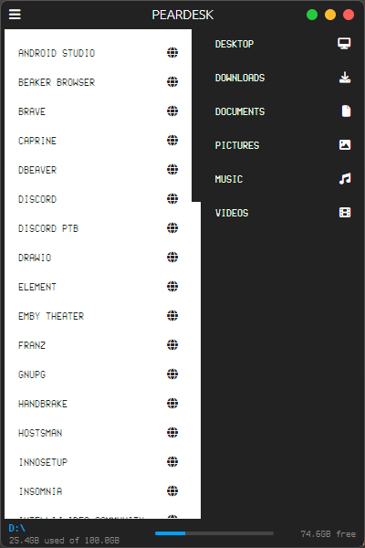
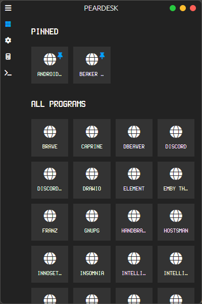
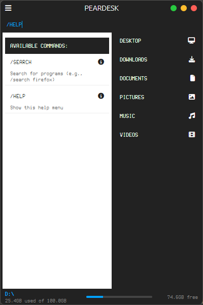
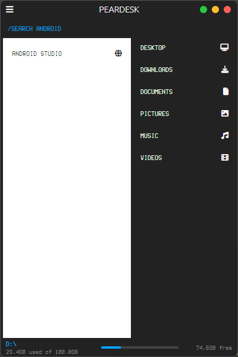

# PEARDESK LAUNCHER

## DESCRIPTION
PEARDESK LAUNCHER IS A PROGRAM LAUNCHER FOR PEARDESK, DESIGNED TO PROVIDE EASY ACCESS TO PORTABLE APPLICATIONS. PEARDESK IS A FREE AND OPEN SOURCE SOFTWARE THAT ALLOWS YOU TO CREATE YOUR OWN PORTABLE ENVIRONMENT TO CARRY FROM MACHINE TO MACHINE. A GREAT EXAMPLE IS BRINGING YOUR FAVORITE APPS AND
DOCUMENTS TO AND FROM WORK, HOME AND SCHOOL.

## INSTALLATION
TEMPORARY INSTALL METHOD IS TO DOWNLOAD THE ZIP FILE AND EXTRACT THE CONTENTS TO THE PEARDESK FOLDER TO DESIRED LOCATION/DRIVE. PEARDESK IN INTENDED TO RUN FROM THE ROOT OF THE DRIVE BEING USED. ONCE THE FILES ARE EXTRACTED, OPEN THE TERMINAL IN THE ROOT FOLDER AND USE THE FOLLOWING COMMANDS TO INSTALL THE DEPENDENCIES: "NPM INSTALL" THEN USE "NPM START" TO RUN THE APPLICATION. AND INSTALLER AND A BUILT VERSION WITH PROPER EXECUTABLE FILES WILL BE ADDED IN THE FUTURE.

## SCREENSHOTS

## FEATURES
- METRO-STYLE INTERFACE
- PINNABLE PROGRAMS
- QUICK SEARCH FUNCTIONALITY
- SYSTEM FOLDER ACCESS
- DRIVE SPACE MONITORING
- COMMAND SYSTEM (/HELP, /SEARCH)

## BUILT-IN APPS
- PEARDESK CALCULATOR
- PEARDESK TERMINAL
- PEARDESK ASSISTANT

## VERSION
CURRENT VERSION: 00.00.08

## DEVELOPMENT
BUILT WITH:
- ELECTRON
- HTML5
- SASS
- JAVASCRIPT
- NODE.JS
